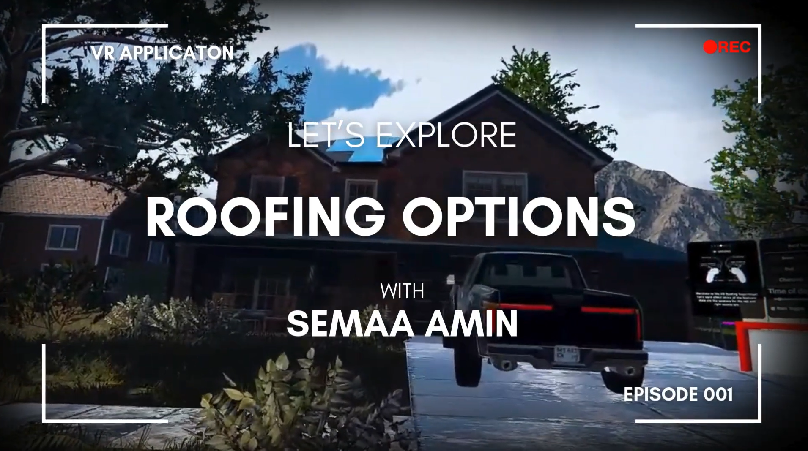
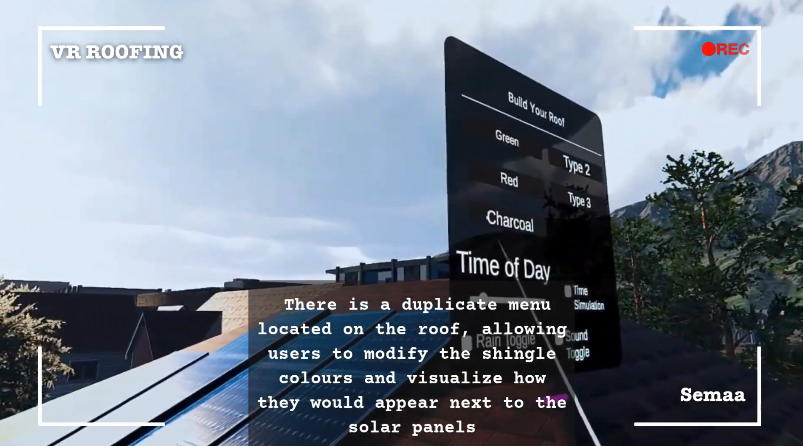
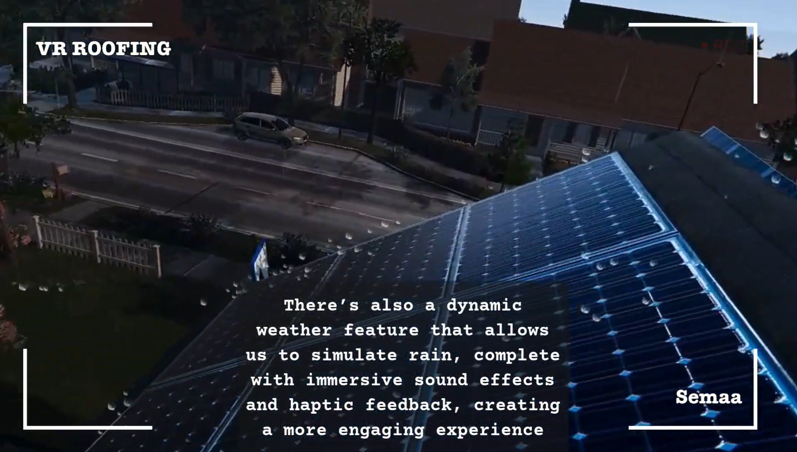

# 🌟 Virtual Reality Roof Experience: Gamified and Immersive! 🏠🎮

Ever wondered what your home would look like with different types of shingles or with solar? Well, wonder no more! This **VR Roof Experience** project allows you to see just that and transforms visualization into an engaging, immersive adventure! 🚀

---

## **📽️ Project Overview**

This project combines the power of Virtual Reality (VR), 3D modeling, and gamification to revolutionize roof visualization and interaction. Whether for professionals or homeowners, this tool provides:

- **Interactive Roof Navigation**: Easily access roofs with gamified guidance. 🕹️
- **Weather Control**: Toggle between sunny skies ☀️ and rainy weather 🌧️, complete with sound and haptic feedback. 🔊🎮
- **Immersive Experience**: Realistic visuals and dynamic soundscapes to ensure an immersive experience 🎨🎧

**⚠️ Note:** Due to proprietary restrictions, the source code for this project cannot be shared publicly.

---

## **✨ Features**

1. **Gamified Roof Access**  
   Navigate roofs efficiently with interactive gamification elements, making the process both intuitive and enjoyable. 🚀

2. **Dynamic Weather Control**  
   - 🌞 Switch between sunny skies and rainy weather.  
   - 🌧️ Feel the rain with haptic feedback and realistic soundscapes.

3. **Roof Visualization**  
   - Empower homeowners to preview their homes with various roofing styles, materials, and colours in real time. 🏡🎨
   - Boost user engagement and decision-making through immersive and interactive VR environments. 🚀✨

4. **Cutting-Edge VR Design**  
   - Built using [Unity](https://unity.com/) and optimized for various VR platforms.
   - Many 3D models created in [Blender](https://www.blender.org/)
   - Incorporates realistic textures, lighting effects, and intuitive controls.

---

## **🛠️ Technologies Used**

- **Unity**: Game engine for immersive VR development. 🖥️
- **Blender**: 3D modeling for realistic roof structures and environments. 🏗️
- **C#**: Scripting interactive elements and VR functionality. 💻
- **Haptic Feedback**: Adds a tactile dimension to user interactions. 🎮
- **Spatial Sound Design**: Realistic soundscapes for dynamic weather effects. 🎧

---

## **📂 Repository Structure**

```
VR-Roof-Experience/
├── Assets/             # Unity assets and 3D models
├── Scripts/            # C# scripts for VR functionality
├── Textures/           # High-quality textures for environment
├── Sounds/             # Sound effects for weather and navigation
├── Docs/               # Documentation and project reports
└── README.md           # This file
```

---

## **🎥 Demo**

[](https://www.youtube.com/watch?v=HuTwHA8YWAY)

---

## **📸 Screenshots**

### Roof Navigation in Action 🏠


### Rain Weather Simulation 🌧️


---

## **📜 License**

This project is licensed under the MIT License. See `LICENSE` for details.

---

## **💡 Connect with Me**

👩‍💻 **Semaa Amin**  
Innovator | Developer | XR Enthusiast  
📧 [Email Me](mailto:sema.amin9@gmail.com)  
🌐 [LinkedIn](https://www.linkedin.com/in/semaa-amin/)  

All the world's a VR stage ! 🚀
